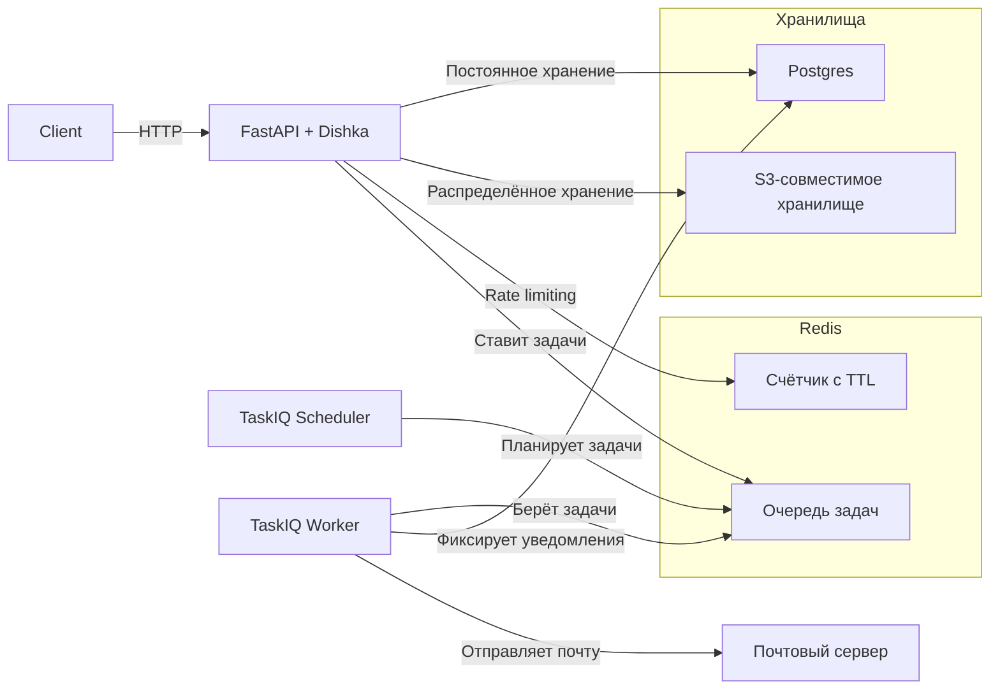
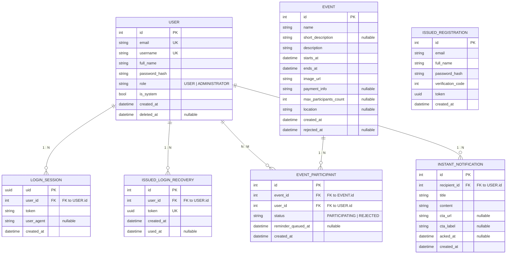

# Backend TTK Афиши

Это бекенд решения команды asyncore кейса от ТТК на хакатоне IT-Tech 2025. 
Решение победило в номинации «Лучшее WEB-приложение» (приз 50 т.р.)

Фронтенд: https://github.com/addavriance/rksi-hack-app

Задеплоенный проект: https://ttk-afisha.lvalue.dev/


## Запуск

1. Установить `docker` и `make`.
2. Скопировать все `.env.example` → `.env` и заполнить.
3. Запустить:
   ```bash
   make up
    ```
4. По умолчанию (.env.example), REST API будет доступен по адресу http://127.0.0.1:8080

## Интеграционные тесты

Интеграционными тестами покрыты все happy-path сценарии за исключением требующих
сложных проверок отправленной почты и планирования доставки уведомлений: это 
тестировалось вручную. По unhappy path есть проверки связанные с важными 
аспектами безопасности, в т.ч. неуспешная аутентификация и авторизация, работа 
рейт лимитера на подтверждение почты.

Как прогнать в рамках запущенного compose стека:
```bash
make test 
```

Примечание: знаю, что дизайн тестов не идеальный (например используются debug 
эндпоинты), но он в полной мере выполнял свою задачу в рамках хакатона: 
дать уверенность в том, что во время защиты всё точно работает.

## Архитектура в первом приближении




## Сущности, жизненный цикл которых поддерживается РСУБД


## Про безопасность

- Есть рейт лимит на подтверждение почты (кулдаун min(30с*2**retries_count, 1ч),
  начинает блокировать ввод после второй неудачной попытки)
- Пароль хэшируется алгоритмом argon2 с солью (используется готовое решение 
  полного флоу самого процесса хэширования); подробности того, как именно
  работают процессы связанные с аутентификацией и авторизацией можно найти
  в python/src/hack/core/services/access.py.
